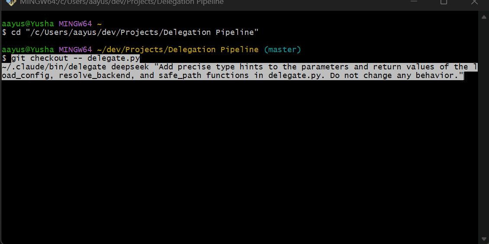

# Delegation Pipeline

[](https://github.com/aayushpokhrel1/delegation-pipeline/stargazers)
[](LICENSE)
[](https://www.python.org/)

[](#install-as-a-claude-code-plugin)
[](https://github.com/aayushpokhrel1/delegation-pipeline/pulls)
[](#proof-it-measurably-cuts-orchestrator-tokens)

Offload token-heavy grunt work from your paid Claude Code session to **free or cheap
models**, so your Claude usage goes to the thinking, not the typing.

`delegate` is a zero-dependency Python worker (stdlib only) that runs a small agentic
loop over any **OpenAI-compatible** endpoint. It can read, search, and edit files in the
current repo. It **cannot** run shell commands or use git, by design: you (or your Claude
orchestrator) review the resulting `git diff` and commit.

```
~/.claude/bin/delegate <backend> "<task>"
```



## Proof: it measurably cuts orchestrator tokens

Not just a claim. [`bench/`](bench/) runs a reproducible A/B where every task is done two
ways and measured from real OpenAI-compatible `usage` fields, and each result is gated by a
pytest that fails until the work is actually correct, so a row only counts if the change
really worked.

**savings% = 1 - T_review / T_do**: when it delegates, the orchestrator pays only `T_review`
(write a brief + skim the diff) instead of `T_do` (doing the whole task itself). The ratio is
model-independent, so it transfers to your Opus orchestrator without needing a Claude key.

| Task | Tier | T_do (do it inline) | T_review (delegate) | **Savings** | Offloaded to cheap tier |
|------|------|--------------------:|--------------------:|:-----------:|------------------------:|
| subtract   | mechanical  |  3,241 |   828 | **74.5%** |  3,306 |
| docstrings | mechanical  |  6,349 |   861 | **86.4%** |  4,516 |
| money      | substantial |  7,048 | 1,009 | **85.7%** |  2,619 |
| validate   | substantial | 12,977 |   956 | **92.6%** |  9,880 |

**Median: ~86% fewer orchestrator tokens per task** (74-93% band across runs at temperature
0.2), with ~20k tokens of real coding work pushed onto the cheap tier. All four tasks passed
both arms (`inline ok` / `worker ok`).

A real datapoint from building this benchmark: `bench/run_bench.py` itself (~250 lines,
stdlib only) was written by a `deepseek` worker that consumed **109,058 tokens**; the Opus
orchestrator paid only the brief plus one diff review, the same asymmetry, on the real
orchestrator, on a non-toy file.

Reproduce it in under a minute:

```bash
pip install pytest
python bench/run_bench.py --worker deepseek --baseline deepseek   # or --worker free
```

Every run also prints a per-task `TOKENS: total=… ` trailer (work that ran off your
subscription) and rewrites [`bench/RESULTS.md`](bench/RESULTS.md). Full methodology and the
honest caveats live in [`bench/README.md`](bench/README.md).

## Backends

| Backend    | Provider              | Cost         | Notes                                    |
|------------|-----------------------|--------------|------------------------------------------|
| `free`       | OmniRoute (local)     | $0           | Local gateway, `auto/coding` model       |
| `nvidia`     | NVIDIA API Catalog    | free credits | build.nvidia.com; strong models, free tier |
| `openrouter` | OpenRouter API        | free / cheap | Pin a specific `:free` or vision model; `:free` ids are rate-limited |
| `deepseek`   | DeepSeek API          | cheap        | Reliable; good default for real work     |
| `kimi`       | Kimi / Moonshot API   | premium      | Strongest; use when quality matters      |

All of them are just an OpenAI-compatible base URL + model + key, configured in
`~/.claude/delegate.config.json`.

## Install

Clone this repo anywhere, then run the installer for your OS:

```bash
bash install.sh
```

```powershell
./install.ps1
```

This writes a `delegate` launcher into `~/.claude/bin/` (pointing at your checkout) and
seeds `~/.claude/delegate.config.json` from the example. Re-run after moving the repo.

### Install as a Claude Code plugin

Prefer plugins? Add this repo as a marketplace and install, straight from Claude Code:

```
/plugin marketplace add aayushpokhrel1/delegation-pipeline
/plugin install delegation-pipeline
```

That gives you the `/delegate` command and the `delegate` skill. The worker binary itself
still comes from the installer above (`bash install.sh` / `./install.ps1`), which writes
`~/.claude/bin/delegate` and seeds the config. Run it once after installing the plugin.

### Keys

- **free**: no key. Just run OmniRoute in another terminal:
  ```bash
  npx omniroute      # serves http://localhost:20128/v1
  ```
  Or have it start automatically at every logon (Windows), see
  [Autostart](#autostart-windows) below.
- **deepseek / kimi**: set env vars, or paste the key into `delegate.config.json`
  (that file is git-ignored):
  ```bash
  export DEEPSEEK_API_KEY=sk-...
  export MOONSHOT_API_KEY=sk-...
  ```
- **nvidia**: get a free key at https://build.nvidia.com (any model page → "Get API Key",
  it starts with `nvapi-`), then:
  ```bash
  export NVIDIA_API_KEY=nvapi-...
  ```
  The `nvidia` backend is OpenAI-compatible via `https://integrate.api.nvidia.com/v1`.
  It defaults to `nvidia/nemotron-3-super-120b-a12b` (verified tool-calling); override per run
  with `--model`. The catalog changes fast (models EOL or are account-gated, and the previous
  `deepseek-ai/deepseek-v4-flash-0731` default now hangs), so use `--list-models` and see
  [`MODELS.md`](MODELS.md). This is a great **free** path when OmniRoute's routes are dry.

  You can also plug NVIDIA into OmniRoute itself (so the `free`/`auto` router can use it):
  open `http://localhost:20128` → provider keys → add the NVIDIA key. Either way works;
  the direct `nvidia` backend is the more predictable of the two.
- **openrouter**: get a key at https://openrouter.ai/keys, then:
  ```bash
  export OPENROUTER_API_KEY=sk-or-...
  ```
  OpenAI-compatible via `https://openrouter.ai/api/v1`. Defaults to
  `nvidia/nemotron-3.5-lightning:free`; free models carry a `:free` suffix and are rate-limited
  (~50 requests/day at $0, ~1000/day with ~$10 of credits). The worker needs tool calling and
  the catalog churns, so `--list-models` first and see [`MODELS.md`](MODELS.md). OmniRoute's
  `free` backend already routes *through* OpenRouter, so reach for this direct backend when you
  want to **pin** a specific fast/free or vision model instead of auto-routing.

### Autostart

So you never have to start the gateway by hand. Logs land in `~/.claude/omniroute.log`,
and every installer prefers a global `omniroute` (`npm i -g omniroute`) and falls back to
`npx --yes omniroute`.

**Windows** (Scheduled Task, launches hidden at logon):
```powershell
powershell -ExecutionPolicy Bypass -File scripts\install-autostart.ps1
Start-ScheduledTask -TaskName "OmniRoute Gateway"                 # start now, no reboot
powershell -ExecutionPolicy Bypass -File scripts\uninstall-autostart.ps1   # remove
```

**macOS** (launchd agent, `RunAtLoad` + `KeepAlive` so it restarts if it dies):
```bash
bash scripts/install-autostart.sh          # starts immediately and at every login
bash scripts/uninstall-autostart.sh        # remove
```

**Linux** (systemd `--user` service, restarts on failure):
```bash
bash scripts/install-autostart.sh          # enable + start now, and at every login
sudo loginctl enable-linger "$USER"        # optional: keep running without an active login
bash scripts/uninstall-autostart.sh        # remove
```

All installers are idempotent, they won't start a second copy if one is already running.
For a one-off manual start on macOS/Linux without installing autostart, use
`bash scripts/start-omniroute.sh`.

### Widening the free pool (recommended)

OmniRoute ships with only a couple of keyless free providers (OpenCode Zen, Felo). Their
shared quota is frequently exhausted (`403 insufficient_quota` / `429`), which makes the
bare `free` backend unreliable. Add your own **free-tier** API keys so the router has
healthy routes to fall back to. All of these give a free key at signup:

| Provider          | Free tier                    | Get a key                         |
|-------------------|------------------------------|-----------------------------------|
| **Groq**          | Fast, generous free tier     | https://console.groq.com/keys     |
| **Cerebras**      | ~1M tokens/day free          | https://cloud.cerebras.ai         |
| **Google Gemini** | Free tier (Flash models)     | https://aistudio.google.com/apikey |
| **Mistral**       | Free experiment tier         | https://console.mistral.ai        |
| **OpenRouter**    | `:free` models               | https://openrouter.ai/keys        |
| **GitHub Models** | Free (rate-limited)          | GitHub settings → developer token |

Add them in the OmniRoute dashboard (open `http://localhost:20128` → provider/keys page,
keys are encrypted at rest), or via CLI (`omniroute keys`). Groq + Cerebras + Gemini alone
make `free` solidly usable for grunt work. When free is dry, `deepseek` remains the
reliable paid-but-cheap fallback.

The worker also sends a normal `User-Agent` (some Cloudflare-fronted free providers
return `1010 browser_signature_banned` to the default `Python-urllib` signature) and
retries transient provider errors (401/403/429/5xx). Because the free pool is
load-balanced, a retry re-rolls to a different provider, so one bad route no longer fails
the whole run.

## Use it

```bash
# smoke test (needs OmniRoute running)
~/.claude/bin/delegate free "Summarize what this project does in 3 bullets"

# real grunt work
~/.claude/bin/delegate deepseek "Add type hints to every function in src/parser.py"
~/.claude/bin/delegate free --model auto/cheap "Write a docstring for each function in utils/"
~/.claude/bin/delegate nvidia "Convert callbacks to async/await in api/client.py"

# vision: attach an image (needs a vision-capable model)
~/.claude/bin/delegate openrouter --model inclusionai/ling-3.0-flash-vl:free \
  --image mockup.png "Build the login form in src/Login.jsx to match this mockup"
```

Step logs stream to **stderr**; the final **summary** prints to **stdout**.

Flags: `--dir <path>` (repo root, default cwd), `--model <id>` (override),
`--image <path|url>` (attach an image, repeatable, needs a vision model; the worker can also
fetch images mid-task via its `view_image` tool), `--max-steps N`, `--list-models` (print the
backend's catalog and exit), plus `--verify` / `--commit` (below).

### Letting Claude pick the model

The tool never auto-selects a model beyond each backend's default, that's the
orchestrator's job. When you say "delegate" (or run `/delegate`, or Opus drives the raw CLI
on its own), Claude sizes up the task and chooses **both the backend and the model/route**,
using `--list-models` to see the live catalog and [`MODELS.md`](MODELS.md) as the shortlist.
Two flavors of choice:

- **`free` (OmniRoute)** → Claude picks an `auto/*` **route** (`auto/coding`, `auto/cheap`,
  `auto/fast`, ...) and lets OmniRoute's router pick the concrete model, so it fails over
  across your provider keys. Prefer routes over pinning one model here.
- **`nvidia` / paid backends** → Claude picks a concrete **model id** (there's no router in
  front), restricted to tool-calling-capable models since the worker edits via function
  calls.

You can always force a specific backend/model/route by naming it: `delegate free --model
auto/cheap "..."` or `delegate nvidia --model nvidia/nemotron-3-super-120b-a12b "..."`.

### From inside Claude Code: `/delegate`

The installer also drops a `/delegate` slash command into `~/.claude/commands/`, so you can
trigger a delegation without leaving your Claude session:

```
/delegate deepseek Add type hints to every function in src/parser.py
/delegate free Write a docstring for each exported function in utils/
```

The command has Claude expand your request into a tight, self-contained spec, run the
worker, then review the resulting `git diff` and report back. First token is the backend
(`free` if omitted); the rest is the task.

A `free` worker can take minutes, since the free model is the slow part. Run it with a long
foreground timeout so it isn't detached to the background mid-run. If your shell or tool
does background it at a default timeout, that only cuts off the *wait*: the worker keeps
running and its file writes still land. Just confirm the run finished before treating the
diff as complete, reading files while a backgrounded worker is still going can show a
half-applied tree. `deepseek`/`nvidia` are faster if you want to avoid the wait entirely.

## How Claude should drive it

The orchestrator protocol lives in your global `~/.claude/CLAUDE.md`. In short:

1. Write a tight, self-contained instruction (name the files, describe the change,
   point at a pattern to mirror). The worker has no conversation context.
2. Delegate on a clean tree so the resulting `git diff` is attributable.
3. **Review** the diff. Fix small issues yourself; re-delegate with a sharper spec if it
   drifted. Workers never commit.
4. You run tests and commit, after review.

Route by complexity, the gate is a tight verifiable spec, not low difficulty: `free` for
trivial/mechanical work (boilerplate, repetitive edits, docstrings, stubs); `deepseek`
(roughly Sonnet-class) for substantial well-specified work (a whole module, a real refactor,
a non-trivial first draft), do not cap delegation at boilerplate. Keep design, tricky
debugging, security-sensitive code, deep-context work, and one-liners in the Claude session.

### Proactive delegation (no `/delegate` needed)

The orchestrator (Opus) is set up to delegate **on its own** whenever a request contains
work it can spec and verify, mechanical or substantial, without you typing `/delegate`. It announces the backend/model in
one line, runs the worker, reviews the diff, and folds the result in. `/delegate` and
saying "delegate this" still work as manual triggers; they're just not required. Say
**"don't delegate this"** to keep a task (or a sensitive repo) in-session.

Note: delegating sends repo content to external model providers (`deepseek`/`nvidia` are
remote; `free`/OmniRoute routes out too). That's the intended trade; disable it per-repo
when the code is sensitive.

This behavior lives in your **global `~/.claude/CLAUDE.md`**, not in this repo, so it
travels with that file, not with a clone. To enable it on another device, add a block like
this to that device's `~/.claude/CLAUDE.md`:

```markdown
# Delegation to cheap-model workers
Use `~/.claude/bin/delegate <backend> [--model <id>] "<task>"` to offload work.
Delegate proactively (no /delegate needed): announce the backend/model in one line, run
the worker, then review the git diff. Route by COMPLEXITY (the gate is a tight verifiable
spec, not low difficulty): `free` for trivial/mechanical work; `deepseek` (roughly
Sonnet-class) for substantial well-specified work like a whole module or a real refactor,
do not cap it at boilerplate; `nvidia` when free is dry (tool-calling models only, see
MODELS.md). Keep design, tricky debugging, security-sensitive code, deep-context work, and
one-liners in-session. Stop if told "don't delegate this".
```

(The full version is in this repo's git history / the author's own CLAUDE.md.)

## Combined Orchestration

The delegation pipeline and Claude subagents are two ways to move work off the paid
orchestrator. Combined orchestration routes each task to the cheapest tier that can do it,
so Claude tokens go to planning and judgment, not typing.

### The model

One orchestrator, two worker tiers.

- **Orchestrator** = Claude Opus in a Claude Code session. Holds the plan, writes a tight
  per-task brief, routes each task, and adjudicates reviews. It is the only component that
  spends Claude tokens, and it never writes implementation code itself.
- **Tier B** = this delegation pipeline (`free` / `deepseek` / `nvidia`). Zero Claude tokens.
  **This is the default tier** for both implementation and review.
- **Tier A** = Claude subagents (the Agent tool: `haiku` / `sonnet` / `opus`). Costs Claude
  tokens. An escape hatch, not a default.

### Routing table

Route each task on three axes. Any single axis landing in the right column sends the task to
Tier A; otherwise it stays on Tier B.

| Axis | Tier B (default, no Claude tokens) | Tier A (escalate, costs tokens) |
|------|------------------------------------|---------------------------------|
| **Complexity** | mechanical / boilerplate -> `delegate free`; substantial but specifiable, a whole module or a real refactor -> `delegate deepseek` | needs broad codebase judgment -> subagent `sonnet` / `opus` |
| **Iteration depth** | verifiable in ~one shot (orchestrator runs verify once, commits) | long autonomous run-fail-edit loop, or needs a live service / Docker / the app running |
| **Sensitivity** | ordinary code | security-sensitive, or full-context debugging (Tier A, or the orchestrator itself) |

Reviews default to Tier B too: a `deepseek` worker reviews the diff against the brief for
zero Claude tokens.

**Cost gate.** Delegation is not free of the orchestrator's tokens: the brief, the review,
and any re-run all cost Claude tokens. Before routing a task to Tier B, the orchestrator
weighs that overhead against doing it inline, and keeps the task in-session when the brief
plus review would cost as much as the edit itself. The pipeline only saves tokens when the
work is bulkier than its description, which is why one-liners stay in-session.

### The loop (per task)

1. **Brief.** The orchestrator writes a tight, self-contained brief: exact files, the change,
   a pattern to mirror, exact values. The worker has no conversation context.
2. **Route and run.** Pick a backend by the table and hand off. The worker edits; the CLI
   verifies and commits on green:
   ```bash
   ~/.claude/bin/delegate deepseek \
     --verify "npm test" \
     --commit "feat: <what changed>, per brief" \
     "<the full brief>"
   ```
3. **On red.** A failed verify exits 2 and commits nothing, printing the command output. The
   orchestrator reads that output and either re-delegates with the failure folded in as a
   sharper spec, or escalates the task to a Tier A subagent.
4. **Review.** A second worker reviews the committed diff against the brief, for zero Claude
   tokens:
   ```bash
   git show HEAD > review.diff
   ~/.claude/bin/delegate deepseek \
     "Review the diff in review.diff against the brief in brief.md. Report spec compliance and code quality, most severe first. Do not edit anything."
   ```
   The orchestrator adjudicates: accept, fix inline, or re-delegate.
5. **Escalate.** Go to Tier A only when the loop cannot converge, or the task hits one of the
   axes above.

### The verify/commit flow

`--verify "<cmd>"` runs the command after the worker finishes editing. A non-zero exit prints
the output and exits 2 without committing. `--commit "<msg>"` stages all changes and commits,
but only when verify passed (or no `--verify` was given). Together they make a delegated task
self-contained: the orchestrator hands off a brief and gets back a tested, committed result,
without babysitting the test-and-commit cycle and without spending Claude tokens on it.

```bash
# mechanical, free tier, verified and committed in one shot
~/.claude/bin/delegate free \
  --verify "python -m pytest tests/test_utils.py -q" \
  --commit "test: cover utils edge cases" \
  "Add the three missing edge-case tests to tests/test_utils.py, mirroring the table-driven style already there."

# check the outcome
echo $?   # 0 = verified and committed; 2 = verify failed, nothing committed
```

On Windows, `--verify` runs through `cmd.exe`, so pass one command (`npm test`,
`npx tsc --noEmit`), not a bash `&&` / `;` chain.

**The trust boundary holds.** The worker *model* still never runs shell or git. Only the
caller's `--verify` and `--commit` flags run commands, and only the orchestrator sets them.
See [Tools the worker has](#tools-the-worker-has).

The [`/orchestrate`](commands/orchestrate.md) command and the `orchestrate` skill encode this
whole table and loop, so an orchestrator invokes one thing instead of re-deriving it each
session.

## Tools the worker has

`list_dir`, `find_files`, `read_file`, `search_text`, `write_file`, `edit_file`.
No shell, no network beyond the model endpoint, no git. File access is sandboxed to the
working directory. The `--verify` / `--commit` flags are the one exception, and they are run
by the CLI harness (the caller), never by the worker model.

## Portability

Everything the worker needs is one `delegate.py` file and the stdlib, so it runs on any
device with Python 3.8+. Sync = clone this repo + run the installer. Real keys live in
`~/.claude/delegate.config.json` (git-ignored), never in the repo.

## Related: save Claude tokens on graphify too

Same spirit, different mechanism. The [`graphify`](https://github.com/aayushpokhrel1) skill
builds knowledge graphs; its **semantic** extraction (docs, papers, images) otherwise
dispatches Claude subagents, which spends your Claude tokens on the initial build. Set a
Gemini key once and graphify routes that work to Gemini instead:

```powershell
[Environment]::SetEnvironmentVariable("GEMINI_API_KEY", "<your-key>", "User")
[Environment]::SetEnvironmentVariable("GOOGLE_API_KEY", "<your-key>", "User")
```

```bash
export GEMINI_API_KEY="<your-key>"    # or GOOGLE_API_KEY; graphify accepts either
```

Code-only corpuses skip semantic extraction entirely and never cost subagent tokens.
Already-running Claude Code sessions must be fully restarted to pick up a newly set key.
Details live in the graphify skill's `SKILL.md` ("Save Claude tokens: set a Gemini key").
Get a key at https://aistudio.google.com/apikey.

### This repo is graphify-integrated

This repo ships a graphify knowledge-graph integration so Claude consults the graph
before falling back to raw search, and keeps it current automatically:

- **`CLAUDE.md`** — guidance telling Claude to run `graphify query`/`path`/`explain`
  before answering codebase questions, and `graphify update .` after code changes.
- **`.claude/settings.json`** — `PreToolUse` hook-guard that nudges toward the graph
  on search/read tools.
- **`.gitattributes`** — a merge driver for the generated `graph.json`.
- The generated graph itself lives in `graphify-out/` (git-ignored, rebuilt locally).

After cloning, run this once to install the local **git hooks** (post-commit and
post-checkout rebuild the graph; hooks live in `.git/` and are never version-controlled):

```bash
graphify hook install
```

The `.claude/settings.json` hook-guard invokes `graphify` from your `PATH`, so it's
portable across machines as long as graphify is installed and on `PATH`.

## License

This project is licensed under the MIT License. See [LICENSE](LICENSE) for details.
